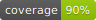
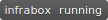
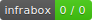

# Badges
With InfraBox you can easily create one or multiple badges like  with your custom information. To create a badge simply create a json file like the following and save it to `/infrabox/upload/badge/<some-name-of-your-choice>.json`.

```json
{
    "version": 1,
    "subject": "build",
    "status": "failed",
    "color": "red"
}
```

You can also save multiple files with different names in this directory.
For every file a separate badge will be created.

For a list of predefined colors checkout [shields.io](https://shields.io/), which gets called internally for generating the badge.

Beside copying the Markdown snippet necessary to embed a generated badge from the job view in the UI one can manually craft queries towards the `/badge.svg` endpoint:

```
<infrabox-url>/api/v1/projects/<project-id>/badge.svg?subject=<subject>&job_name=<job_name>&branch=<branch>
```

Template         | Meaning                   | Optional
-----------------|---------------------------|----------
`<infrabox-url>` | InfraBox service url.     | False
`<project-id>`   | Project ID for api access | False
`<subject>`      | Badge subject             | False
`<job_name>`     | Fully-qualified job name  | False
`<branch>`       | Git branch                | True
`<build_number>` | Build number i.e. `432`   | True
`<build_restart_counter>` | Restart counter, default `1` | True


Additionally, there are also two job-independent badges:
- `<infrabox-url>/api/v1/projects/<project-id>/state.svg?branch=<branch>` reflecting the current state of the build ()
- `<infrabox-url>/api/v1/projects/<project-id>/tests.svg?branch=<branch>` showing the amount of passing jobs for the build ()
- `<infrabox-url>/api/v1/projects/<project-id>/tests.svg?branch=<branch>&job_name=<job_name>` showing the amount of passing jobs of given job for the build

Markdown code suitable for embedding can be retrieved from the "Settings" tab of your project (requires administrator privileges).
